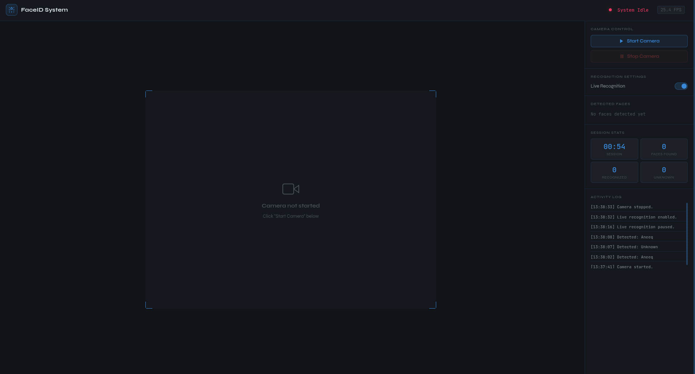

<div align="center">

# FaceID System

**Real-time face detection & recognition, straight from your browser**


</div>

---

## Preview





## What It Does

| Feature | Description |
|---|---|
| **Face Detection** | MediaPipe draws 478 landmark points on every face, every frame |
| **Face Recognition** | Matches detected faces against your known persons database |
| **Live Toggle** | Pause/resume recognition without stopping the video stream |
| **Live Dashboard** | FPS, session timer, face count, recognized vs unknown stats |
| **Activity Log** | Timestamped log of every identity change |

---

## Getting Started

### 1. Install dependencies

```bash
pip install -r requirements.txt
```

### 3. Run

```bash
python app.py
```

Then open **http://127.0.0.1:5000** in your browser.

---

## Adding People to Recognise

This is the only setup step. Create a folder per person inside `known_faces/` and drop their photos in.

```
known_faces/
├── john/
│   ├── photo1.jpg
│   ├── photo2.jpg
│   └── photo3.jpg
└── sarah/
    ├── image1.png
    └── image2.jpg
```

> The folder name becomes the display name on screen (`john` → **John**)

### What makes a good training set

| ✅ Do this | ❌ Avoid this |
|---|---|
| Different lighting conditions | 10 identical photos from the same session |
| Slight angle variations | Heavily compressed or blurry images |
| With & without glasses | Faces that are small or partially cropped |
| 5–10 varied images minimum | Group photos with multiple faces |

**More varied images = better accuracy.** 5 well-varied photos will outperform 15 near-identical ones.

---

## Project Structure

```
faceid-system/
├── app.py                  # Flask backend — camera, recognition, API routes
├── templates/
│   └── index.html          # Browser dashboard UI
├── static/
│   ├── script.js           # Frontend logic — controls, stats, log
│   └── style.css           # Styling
├── known_faces/            # Your training images go here
│   └── person_name/
│       └── photo.jpg
└── face_landmarker.task    # MediaPipe model file
```

---


## API Routes

| Method | Route | Description |
|---|---|---|
| `GET` | `/` | Main dashboard |
| `GET` | `/video_feed` | Live MJPEG camera stream |
| `GET` | `/start_camera` | Start the webcam |
| `GET` | `/stop_camera` | Stop the webcam |
| `GET` | `/get_stats` | JSON stats — FPS, faces, identity, session time |
| `GET` | `/toggle_recognition/<state>` | `on` or `off` |

---

## Notes

- Default camera is device index `0` — change `cv2.VideoCapture(0)` in `app.py` for a different camera
- Recognition runs every **5 frames** — adjust `counter % 5` in `generate_frames()` to change the rate
- `face_landmarker.task` must be in the project root or the app will not start
- For production use a proper WSGI server like **Gunicorn** instead of Flask's dev server

---

<div align="center">
Built with Python · Flask · OpenCV · MediaPipe · face_recognition
</div>
